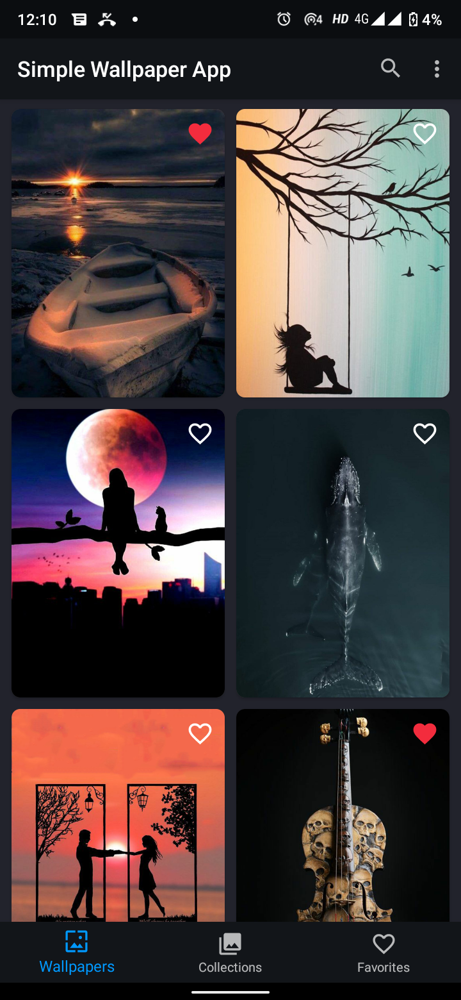
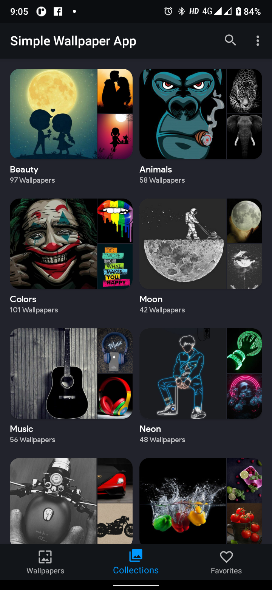
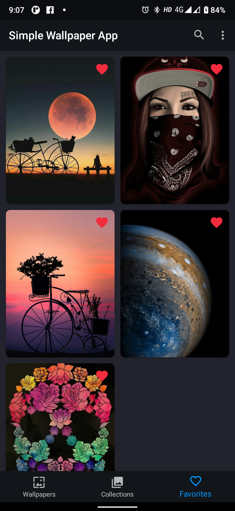
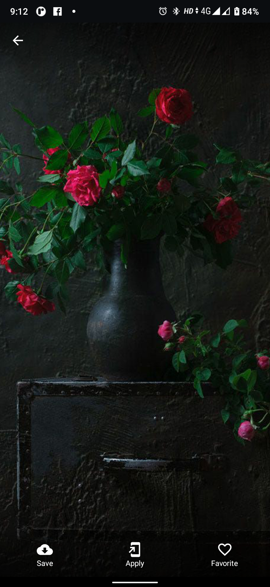
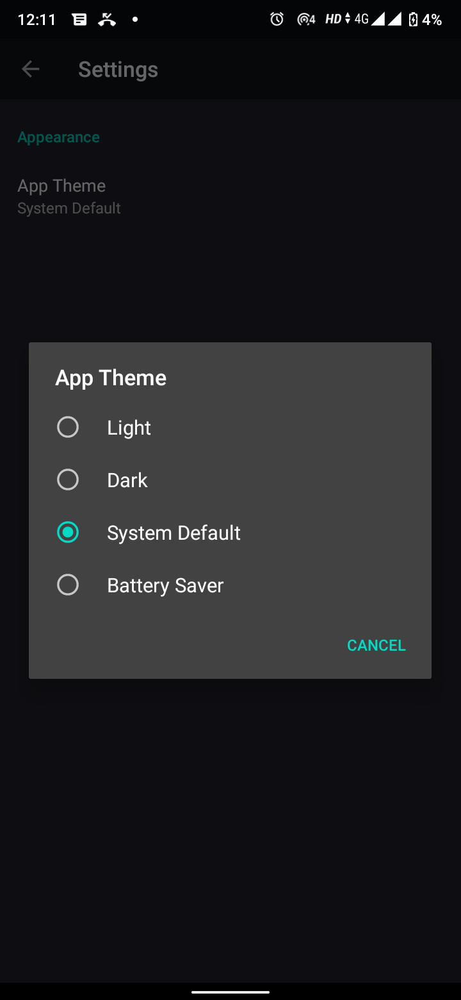
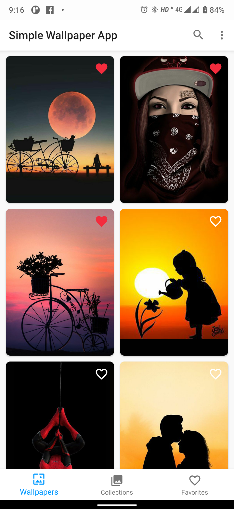

# SimpleWallpaperApp-Android
This is a simple demo wallpaper app which contains wallpaper links (json file) in assets folder.

- No Server Required
- Admob (Native, Banner, Interstial) Ad
- Download Wallpaper
- Sort by Collections
- Clean UI
- Light/Dark Theme

## Screenshots

    
    
    
    
    
    
    
    
    

